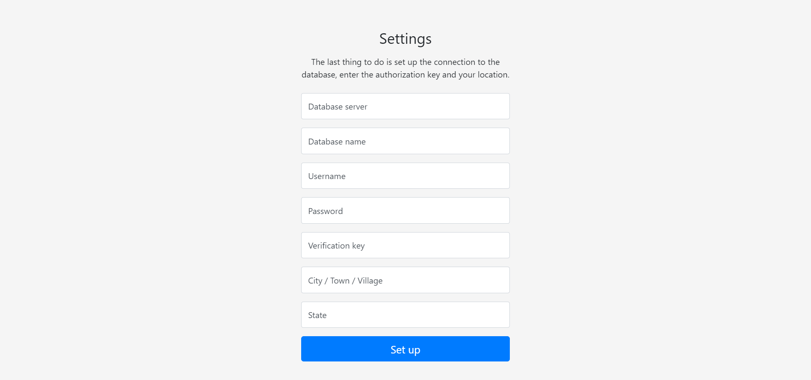

# Weather Station

The project deals with the design and realization of an IoT weather station that measures temperature, relative air humidity, air pressure, air quality and UV index. Further by transferring the obtained data to the web server and their subsequent processing on the website.

### Preview


## Getting Started

These instructions will guide you to getting your own weather station up and running.

### Prerequisites

You will need the following components to build the weather station:

* NodeMCU ESP8266
* BME280
* SI1145
* DS18B20
* MQ-135
* Power supply (5V, 1A)

### Step One

Connect the sensors to the development board as shown in the diagram below.


Then open the sketch *mia_weather_station.ino* for example in the Arduino IDE, change the following lines and upload the code to the development board.

```
const String host = "http://yourdomain.com/Collector.php";
const String key = "your_authorization_key";
```

### Step Two
Upload the source codes from folder *website* to your web server. Access the page and create a database connection and complete the required fields such as an authorization key, state and city.



### Step Three

Power up the development board and wait a bit. Then take your smart phone and connect to the Wi-Fi with ssid **MiaConfiguration** and password **theMia19**. And please follow the instructions now.


## Author

* Daniel Zábojník

## License

This project is licensed under the MIT License - see the [LICENSE.md](LICENSE.md) file for details
